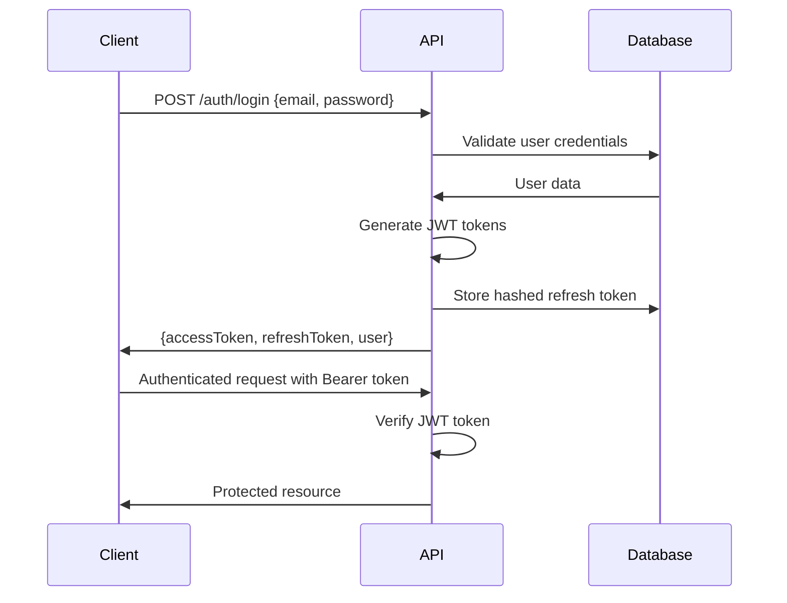

# Style Nation API - Security Documentation

## Security Overview

The Style Nation API implements comprehensive security measures to protect against common vulnerabilities and ensure data integrity. This document outlines all security implementations and best practices followed.

## Authentication & Authorization

### JWT Authentication

#### Token Configuration
- **Access Token**: 15-minute lifespan for security
- **Refresh Token**: 7-day lifespan for user convenience
- **Algorithm**: HS256 (HMAC with SHA-256)
- **Secret**: Environment variable (JWT_SECRET)
- **Claims**: user ID, email, role, issued/expiration times

#### Authentication Flow


### Password Security

#### Hashing Implementation
- **Algorithm**: bcrypt
- **Salt Rounds**: 10 (adjustable via environment)
- **Minimum Length**: 8 characters
- **Complexity**: No special requirements (user-friendly)

#### Password Change Process
1. Verify current password with bcrypt.compare()
2. Hash new password with fresh salt
3. Update database and clear refresh token
4. Reset failed login attempts and unlock account

### Account Security

#### Brute Force Protection
- **Failed Attempt Tracking**: Database counter per user
- **Lockout Threshold**: 5 failed attempts
- **Lockout Duration**: 15 minutes
- **Reset Mechanism**: Successful login or manual admin reset

#### Account Lockout Implementation
```typescript
// Simplified lockout logic
if (user.failedLoginAttempts >= 5) {
  user.lockedUntil = new Date(Date.now() + 15 * 60 * 1000);
}
```

## Authorization Model

### Role-Based Access Control (RBAC)

#### Roles
- **ADMIN**: Full system access
  - User management (create, read, update, delete)
  - Car management (create, read, update, delete)
  - System administration
  - Inquiry management

#### Permission Implementation
- **Guards**: `JwtAuthGuard` + `RolesGuard`
- **Decorators**: `@Roles(Role.ADMIN)` for endpoint protection
- **Default**: All endpoints protected unless marked `@Public()`

#### Route Protection Examples
```typescript
@Controller('users')
@UseGuards(JwtAuthGuard, RolesGuard) // Global guards
export class UsersController {
  
  @Get()
  @Roles(Role.ADMIN) // Admin only
  async findAll() { }
  
  @Get('me')
  // Authenticated users only (no role requirement)
  async getProfile() { }
  
  @Public() // Bypass authentication
  @Post('register')
  async register() { }
}
```

## Input Validation & Sanitization

### Request Validation

#### Validation Pipeline
1. **DTOs with class-validator**: Type and format validation
2. **ValidationPipe**: Automatic validation with detailed errors
3. **Whitelist**: Strip unknown properties
4. **Transform**: Type conversion and sanitization

#### Validation Example
```typescript
export class CreateUserDto {
  @IsEmail()
  @IsNotEmpty()
  email: string;

  @IsString()
  @MinLength(8)
  @IsNotEmpty()
  password: string;

  @IsEnum(Role)
  @IsOptional()
  role?: Role;
}
```

### SQL Injection Prevention
- **Prisma ORM**: Parameterized queries by default
- **Type Safety**: TypeScript prevents injection vectors
- **Input Validation**: All inputs validated before database access

### XSS Prevention
- **No HTML Rendering**: API only (no server-side templates)
- **Content-Type Validation**: JSON only for POST/PUT
- **Output Encoding**: Automatic with JSON serialization

## Data Protection

### Sensitive Data Handling

#### Password Storage
- Never store plaintext passwords
- bcrypt hashing with unique salts
- Password excluded from all API responses

#### Token Security
- Refresh tokens hashed before storage
- Access tokens never stored server-side
- Token rotation on refresh

#### Personal Information
- Email addresses validated and normalized
- Optional fields (name, phone) properly handled
- User data serialization through Entity classes

### Database Security

#### Connection Security
- **SSL/TLS**: Required for database connections
- **Connection Pooling**: Limited concurrent connections
- **Credentials**: Environment variables only

#### Data Integrity
- **Unique Constraints**: Email, VIN number uniqueness
- **Foreign Keys**: Referential integrity maintained
- **Transactions**: Complex operations wrapped in transactions

## API Security

### Rate Limiting

#### Implementation
- **Global Rate Limit**: 100 requests/minute
- **Login Rate Limit**: 5 attempts/minute
- **Configurable**: Environment-based settings

#### Rate Limiting Configuration
```typescript
@Throttle({ default: { limit: 5, ttl: 60000 } }) // 5 per minute
@Post('login')
async login() { }
```

### CORS Configuration
```typescript
app.enableCors({
  origin: process.env.CORS_ORIGINS?.split(',') || ['http://localhost:3000'],
  methods: ['GET', 'POST', 'PUT', 'DELETE', 'PATCH'],
  allowedHeaders: ['Content-Type', 'Authorization'],
});
```

### Security Headers
```typescript
// Helmet.js security headers
app.use(helmet({
  contentSecurityPolicy: false, // API doesn't serve HTML
  crossOriginEmbedderPolicy: false,
}));
```

## Error Handling Security

### Information Disclosure Prevention

#### Error Responses
- **Generic Messages**: "Invalid credentials" instead of "User not found"
- **No Stack Traces**: Production errors sanitized
- **Consistent Format**: Same structure for all errors
- **No Internal Details**: Database errors mapped to HTTP errors

#### Error Examples
```typescript
// Secure - doesn't reveal if user exists
throw new UnauthorizedException('Invalid credentials');

// Insecure - reveals user existence
throw new UnauthorizedException('User not found');
```

## File Upload Security

### Image Upload Protection

#### File Validation
- **Type Validation**: JPEG, PNG, WebP only
- **Size Limits**: 5MB maximum per image
- **Extension Checking**: Validate file extensions
- **MIME Type Validation**: Verify actual file type

#### Storage Security
- **Supabase Storage**: Secure cloud storage
- **Unique Filenames**: Timestamp-based naming
- **Access Control**: Public read, authenticated write
- **Path Traversal Prevention**: Sanitized file paths

#### Upload Implementation
```typescript
validateImageFile(file: any): void {
  const allowedTypes = ['image/jpeg', 'image/jpg', 'image/png', 'image/webp'];
  const maxSize = 5 * 1024 * 1024; // 5MB

  if (!allowedTypes.includes(file.mimetype)) {
    throw new BadRequestException('Invalid file type');
  }

  if (file.size > maxSize) {
    throw new BadRequestException('File too large');
  }
}
```

## Session Management

### JWT Session Security

#### Token Lifecycle
1. **Generation**: Short-lived access tokens
2. **Storage**: Client-side storage (localStorage/sessionStorage)
3. **Validation**: Every protected request
4. **Refresh**: Automatic token renewal
5. **Logout**: Token invalidation (refresh token cleared)

#### Security Considerations
- **No Session Storage**: Stateless authentication
- **Token Blacklisting**: Considered for future implementation
- **Refresh Token Rotation**: New token on each refresh
- **Logout Cleanup**: Clear all stored tokens

## Security Monitoring

### Audit Logging

#### Tracked Events
- **Authentication Events**: Login, logout, failed attempts
- **Account Events**: User creation, password changes, lockouts
- **Administrative Actions**: User management, role changes
- **Security Events**: Suspicious activity, repeated failures

#### Log Implementation
```typescript
// Example audit logging
await this.prisma.user.update({
  where: { id: userId },
  data: {
    failedLoginAttempts: { increment: 1 },
    lastLoginAt: new Date(), // On success
  },
});
```

### Security Metrics
- Failed authentication rate
- Account lockout frequency
- Password change patterns
- API usage patterns

## Environment Security

### Configuration Management

#### Environment Variables
- **Database URLs**: Never hardcoded
- **JWT Secrets**: Complex, randomly generated
- **API Keys**: Secure external service credentials
- **Development vs Production**: Different configurations

#### Required Environment Variables
```bash
# Database
DATABASE_URL="postgresql://..."
DIRECT_URL="postgresql://..."

# Authentication
JWT_SECRET="complex-secret-key"
JWT_EXPIRES_IN="15m"

# External Services
SUPABASE_URL="https://project.supabase.co"
SUPABASE_SERVICE_KEY="service-key"

# Security
CORS_ORIGINS="https://yourdomain.com"
API_RATE_LIMIT=100
```

## Security Testing

### Automated Security Tests

#### Authentication Tests
- Valid/invalid credentials
- Token validation and expiration
- Account lockout scenarios
- Role-based access control

#### Input Validation Tests
- Malformed requests
- Boundary value testing
- SQL injection attempts
- XSS payload testing

#### Authorization Tests
- Unauthorized access attempts
- Role escalation attempts
- Resource access validation

### Security Test Examples
```typescript
describe('Security Tests', () => {
  it('should reject SQL injection attempts', async () => {
    const response = await request(app.getHttpServer())
      .post('/api/auth/login')
      .send({
        email: "admin@test.com'; DROP TABLE users; --",
        password: 'password'
      });
    
    expect(response.status).toBe(400); // Validation error
  });

  it('should prevent unauthorized access', async () => {
    const response = await request(app.getHttpServer())
      .get('/api/users')
      .expect(401);
  });
});
```

## Incident Response

### Security Breach Protocol

1. **Detection**: Monitor for unusual patterns
2. **Assessment**: Determine scope and impact
3. **Containment**: Limit access and prevent spread
4. **Investigation**: Analyze logs and determine cause
5. **Recovery**: Restore services and patch vulnerabilities
6. **Lessons Learned**: Update security measures

### Emergency Actions
- **Immediate Token Revocation**: Clear all refresh tokens
- **Account Lockdown**: Temporarily disable affected accounts
- **System Maintenance**: Enable maintenance mode if needed
- **Communication**: Notify stakeholders of issues

## Security Compliance

### Best Practices Followed
- ✅ **OWASP Top 10**: Protection against common vulnerabilities
- ✅ **Secure Coding**: Input validation, output encoding, error handling
- ✅ **Authentication**: Strong password policy, secure sessions
- ✅ **Authorization**: Least privilege, role-based access
- ✅ **Data Protection**: Encryption at rest and in transit

### Regular Security Tasks
- [ ] **Dependency Updates**: Regular package updates
- [ ] **Security Audits**: Periodic code reviews
- [ ] **Penetration Testing**: External security assessments
- [ ] **Monitoring Review**: Log analysis and alerting
- [ ] **Incident Drills**: Response procedure testing

---

This security implementation ensures the Style Nation API maintains high security standards while providing a smooth user experience. Regular security reviews and updates ensure ongoing protection against emerging threats.